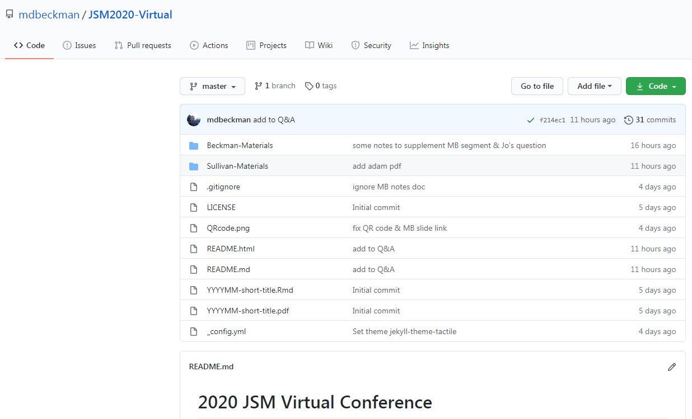

```{r setup, include=FALSE}
knitr::opts_chunk$set(echo = FALSE)

library(tidyverse)
library(kableExtra)

```

# Disclaimer About the Basics

- Simplified, low-resolution definitions of terms
- GitHub (and many other VC systems) are capable of much more than *the basics*
- The terminal is popular vehicle for carrying out git commands, but it's not the only tool


# Language for Using GitHub (and other similar VC systems)

>- **Repository**
>- **Cloning** a repository
>- **Committing** changes to files within a repository
>- **Pushing** to a repository
>- **Pulling** from a repository


# **Repository**

- **Repository**: A directory or storage space where your projects can live.
- Often shortened to "repo"
- Can contain many different types of files, but is more useful for certain types over others

# Local Repository

{ width=90%}

# GitHub Repository

{ width=90%}


# **Cloning** a Repository

- *Cloning* is the process of creating an identical copy of a Git Remote Repository (e.g. GitHub repo) to your local machine

- Often the first step joining a project with an existing repo!

{ width=65%}

# **Committing** changes to files within a repository

>- The traditional software expression of "saving" is synonymous with the Git term "committing"
>- Saving changes to the files in your project on your local machine is just that...local!
>- For your git repository to store and track these changes, they must be **committed**
>- However, the "commit command" only captures a snapshot of the project's currently staged changes
>- These snapshots can be thought of as "safe" versions of the project

# **Pushing** to and **Pulling** from a Repository

>- *Pushing* is used to upload local repository content (e.g. files on your local machine) to a remote repository (e.g. GitHub repo)
>- *Pushing* is how you transfer **commits** from your local repository to a remote repository
>- *Pulling* is used to fetch and download content from a remote repository and immediately update the local repository to match that content

{ width=50%}

# Thank You

\titlepage


<https://mdbeckman.github.io/JSM2020-Virtual/>


